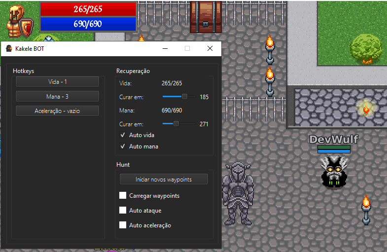

# Kakele Bot 🤖 - [YT](https://youtu.be/6NhE3GDJ5aw)

O Kakele Bot é gratuito e open source.
Bot leve e simples, com reconhecimento óptico de caracteres (OCR).

| Descrição                                                                                          | Imagem |
|----------------------------------------------------------------------------------------------------| --- |
| Iniciando o Bot por um login específico de algum usuário previamente cadastrado no banco de dados. |  |
| Kakele Bot com todas as funcionalidades disponíveis até o momento.                                 |  |


## Principais bibliotecas utilizadas

- [Pytesseract](https://pypi.org/project/pytesseract/)
- [OpenCV](https://pypi.org/project/opencv-python/)
- [PyQt6](https://pypi.org/project/PyQt6/)

:snowflake: Bonus: As imagens são processadas em tempo de execuçao, sem precisar salvar.

## Estrutura do Projeto

O projeto está dividido em três partes principais:

- **comp_out/**: Contém os arquivos que são necessários para o funcionamento do bot, e não precisam ser compilados.
- **forms/**: Contém os arquivos de formulários do bot.
- **system/**: Contém os arquivos de funcionamento do bot.

``` shell
KL-Bot/
├── comp_out/
│   ├── recursos/
│   │   └── kake_icon2.ico
│   ├── samples/
│   │   └── ...
│   ├── targets/
│   │   └── enemy.png
│   ├── tesseract/
│   │   └── ...
├── forms/
│   ├── bot_form.ui
│   ├── bot_window_ui.py
│   ├── login_form.ui
│   └── login_window_ui.py
├── system/
│   ├── downloads.py
│   ├── features.py
│   ├── healing.py
│   └── hunt.py
├── hunt.json
├── kakelebot.py
├── login.py
├── README.md
├── requirements.txt
└── LICENSE
```

## Funcionalidades do bot

### :crossed_swords: Hunt

- [x] Ataque automático
- [x] Movimentação automática do personagem


- _A movimentação do personagem não buga quando um jogador ou monstro fica na frente dele_.

- _Movimente o personagem com teclas de direção pausadamente (sem pressionar a tecla por muito tempo)._

- _Pare o personagem no mesmo lugar que iniciou a movimentação (waypoint)._

### :heart: Healing

- [x] Curar personagem automaticamente (Vida e Mana)

### :gear: Outros

- [x] Aceleração do personagem

## Funcionalidades internas do bot

- [x] Definição de teclas de atalho
- [x] Definição de tempo de espera entre ações
- [x] Funcionamento do bot somente quando o jogo estiver em primeiro plano


## Como instalar?

### Instalando o Python

Primeiro, você precisa instalar o Python 3.6 ou superior. Você pode baixar o Python [aqui](https://www.python.org/downloads/).

### Instalando o Kakele Bot

Agora, você precisa clonar o repositório do Kakele Bot. Para isso, abra o terminal e digite:

`git clone https://github.com/marcellobatiista/KL-Bot.git && cd KL-Bot`

`pip install -r requirements.txt`

### Iniciando o Kakele Bot

Agora, você precisa iniciar o Kakele Bot. Para isso, abra o terminal e digite:

`python3 main.py`

### Gerando o executável

Você pode gerar um executável para o Kakele Bot. Para isso, abra o terminal e digite:

`pyinstaller --noconfirm --onefile --windowed --add-data "C:/CAMINHO/PARA/PASTA/system;system/" --add-data "C:/CAMINHO/PARA/PASTA/forms;forms/"  "C:/CAMINHO/PARA/ARQUIVO/main.py"`

### Iniciando o executável

Agora, você precisa iniciar o Kakele Bot. Para isso, coloque o `kakele.exe` ao lado da pasta `comp_out/` assim e executar:

``` shell
PASTA_QUALQUER/
├── comp_out/
└── main.exe
```

## Como contribuir?

Você pode contribuir com o Kakele Bot abrindo uma [issue](https://github.com/marcellobatiista/KL-Bot/issues)
:bug: **_Bug Report_** ou um [pull request](https://github.com/marcellobatiista/KL-Bot/pulls) 
:sparkles: **_New Feature_** no GitHub.

## Licença

O Kakele Bot é licenciado sob a [licença MIT](LICENSE) :page_facing_up: License.

## Créditos

O Kakele Bot foi feito por [@Marcelo](https://www.instagram.com/marcellobatiista).
